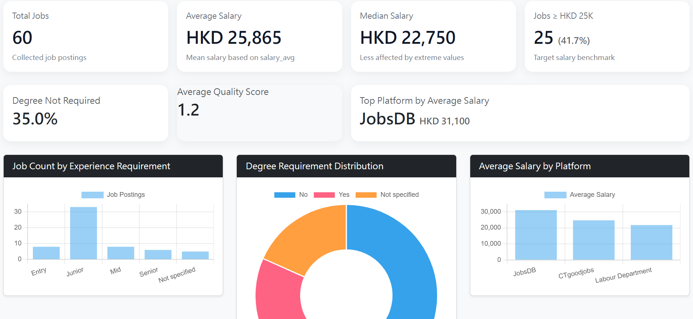
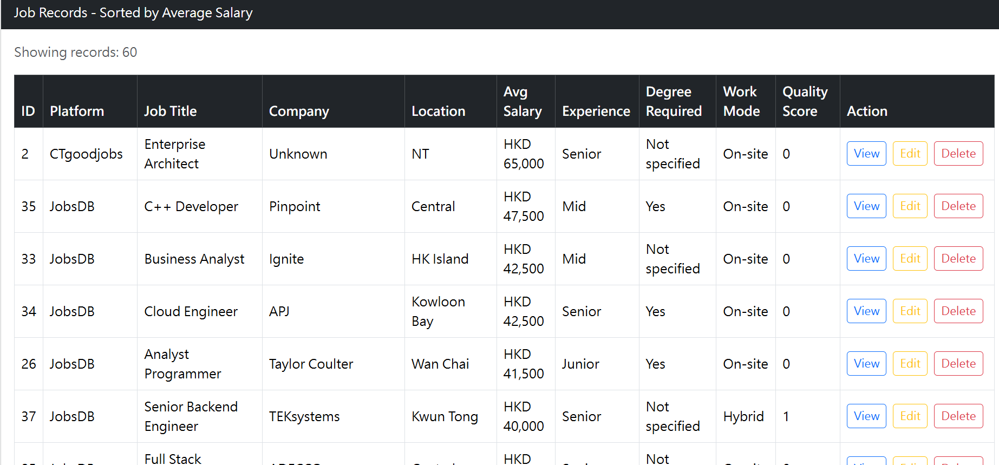
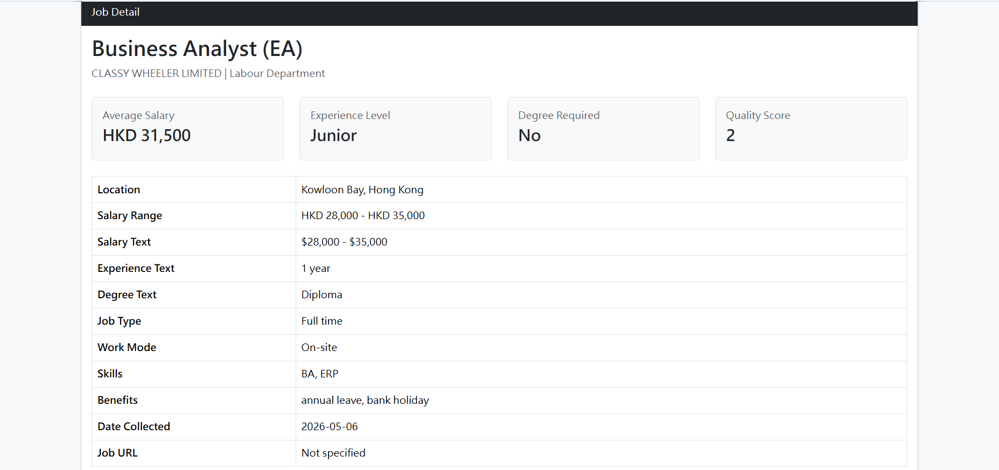
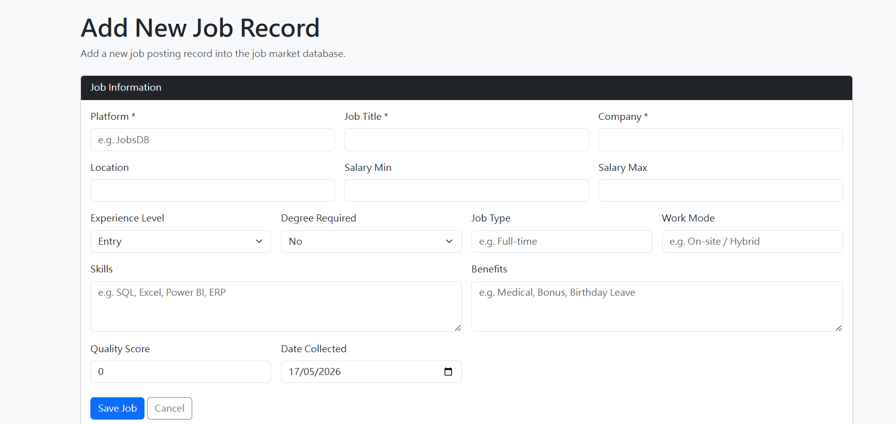
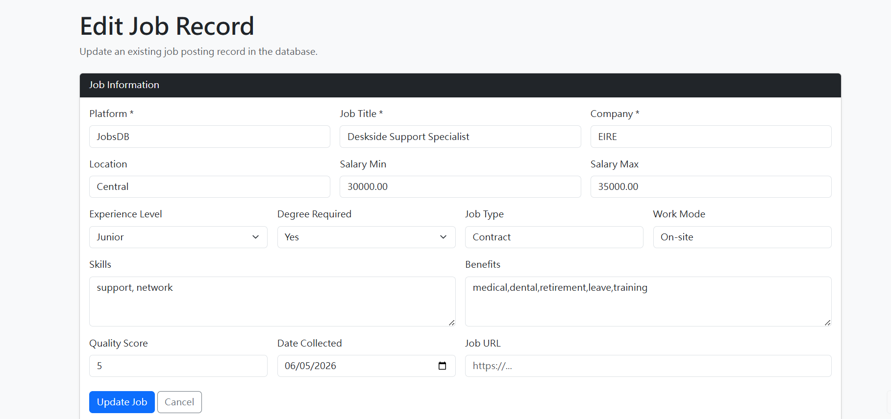

# HK IT Job Market Intelligence System

A PHP + MySQL web-based business system simulation project designed to demonstrate practical workflows commonly used in:

* Application Support
* ERP Support
* Business System Support
* Reporting Support
* Data Operations

This project simulates how internal business systems manage, validate, approve, monitor, and report Hong Kong IT job market data through structured staging and production workflows.

---

Project Purpose

The purpose of this project is to transform raw Hong Kong IT job market data into a structured internal-style business management system.

Instead of building only a static dashboard, this project demonstrates how enterprise systems handle:

* Data staging
* Validation workflows
* Error monitoring
* Approval processes
* Production data protection
* Reporting and operational analysis
* Data quality management

The project focuses on simulating real-world business system operations and support workflows commonly handled by:

* Application Support teams
* ERP support teams
* Business systems teams
* Reporting and operations support teams

---

System Workflow

```text
Add Job Record
↓
Store in jobs_staging
↓
Run Validation Checks
↓
Generate Error Logs
↓
Fix Validation Issues
↓
Re-run Validation
↓
Approve Record
↓
Move to Production Table (jobs)
↓
Display on Dashboard and Reports
```

---

System Architerture

```text
Frontend (Bootstrap UI)
↓
PHP Business Logic
↓
Validation Scripts
↓
MySQL Database
    ├── jobs_staging
    ├── jobs
    └── error_logs
↓
Dashboard / Reports / Monitoring
```

---

Key Features

1. Dashboard Overview

The dashboard provides key business and operational reporting metrics, including:

* Total number of job records
* Average salary
* Median salary
* HKD 25K+ job percentage
* Degree not required percentage
* Platform salary comparison
* Average quality score

The dashboard simulates internal reporting systems used for operational analysis and business monitoring.

---

2. Job Records Management

The system allows users to manage and maintain structured job posting records through a web-based interface.

Features include:

* View job records
* Search by title, company, or skills
* Filter by platform
* Filter by experience level
* Filter by degree requirement
* Salary range filtering

---

3. CRUD Operations

The project supports full CRUD functionality:

* Create new records
* Read and search records
* Update records
* Delete records

CRUD operations are separated from production approval workflow to simulate enterprise-style data control.

---
4. Staging Workflow

### jobs_staging

instead of directly affecting the production table.

This staging workflow helps protect production data quality before approval.

The staging process simulates simplified ETL and business system workflows commonly used in enterprise systems.

---

5. Data Validation and Error Monitoring

The system includes automated validation logic and issue tracking features.

Current validation checks include:

* Missing salary detection
* Duplicate record detection
* Invalid data monitoring

Detected issues are automatically logged into:

### error_logs

with issue status management.

---

6. Error Lifecycle Workflow

The project supports a simplified issue lifecycle process:

```text
Open
↓
Edit Staging Record
↓
Re-run Validation
↓
Resolved
↓
Approve
```

This simulates internal support workflows commonly handled by:

* Application Support teams
* ERP support teams
* Business operations support teams

---

7. Approval Workflow

Records with unresolved validation issues cannot be approved into the production table.

This demonstrates:

* Production data protection
* Approval control
* Validation-based workflow management

---

8. Operational Reporting and Salary Monitoring

The dashboard includes reporting functions for monitoring:

* Salary benchmarking
* Experience-level salary comparison
* Platform salary comparison
* Degree requirement trends
* Quality score distribution

This simulates internal operational reporting systems used for business analysis and decision support.

---

9. Technology Skill Trend Monitoring

The system groups and normalizes IT skills from job postings into structured categories.

Examples include:

* IT Support / Helpdesk
* SQL / Database
* ERP
* Excel / Reporting
* Power BI
* Networking
* Microsoft 365
* Business Analysis
* Programming Languages

This helps reduce fragmented skill naming inconsistencies.

---

Real-World Problems Addressed

This project simulates handling common enterprise data management issues, including:

* Duplicate records
* Missing salary data
* Production data protection
* Validation workflow control
* Data staging before approval
* Error monitoring and resolution
* Structured issue lifecycle management
* Data quality inconsistencies

---

Tech Stack

* PHP
* MySQL
* Bootstrap 5
* HTML / CSS
* Chart.js
* XAMPP
* phpMyAdmin

---

Database Structure

jobs

Production table used by:

* Dashboard
* Reporting pages
* Search pages
* Job detail pages

Only approved and validated records are stored here.

---

jobs_staging

Staging table used for temporary record validation before approval.

This table supports:

* Data validation
* Error checking
* Approval workflows
* Data quality control

---

error_logs

Used for issue monitoring and validation tracking.

Tracks:

* Missing salary records
* Duplicate records
* Validation status
* Open / Resolved lifecycle

---

Project Structure

```text
job-market-system/
│
├── assets/
│   └── css
├── config/
│   └── db.php
├── data/
│   └── job_data.csv
├── images/
├── includes/
│   └── navbar.php
├── public/
│   ├── dashboard.php
│   ├── delete_job.php
│   ├── edit_job.php
│   ├── jobs.php
│   ├── jobs_detail.php
│   ├── staging.php
│   ├── error_logs.php
│   ├── edit_staging.php
│   ├── test_db.php
│   ├── approve_staging.php
│   └── add_job.php
│
├── scripts/
│   └── check_errors.php
│
├── sql/
│    └── job_market_db.sql
└── README.md
```
---

Business System Concepts Demonstrated

This project demonstrates practical concepts commonly found in internal business systems:

* Staging vs Production workflow
* Data validation
* Error logging
* Approval workflow
* Issue lifecycle management
* Production data protection
* Reporting systems
* CRUD operations
* Business support workflows
* Data quality management

---

Key Learning Outcomes

Through this project, I learned:

* Data staging and validation concepts
* Production vs staging workflow design
* Error logging and issue lifecycle handling
* CRUD operation management
* Business system workflow simulation
* Basic data quality management
* Support-oriented system thinking
* Operational reporting concepts

---

Future Improvements

Potential future enhancements include:

* User role permissions
* Login authentication
* Scheduled validation automation
* CSV import automation
* Advanced reporting
* Audit logs
* Email notification workflow
* ERP-style approval tracking
* Automated ETL workflow

⸻

Screenshots

Dashboard



Staging Workflow

(Add screenshot here)

Error Monitoring

(Add screenshot here)

Approval Workflow

(Add screenshot here)

Validation and Issue Lifecycle

(Add screenshot here)

Job records page



Job detail page



Add job function



Edit job function



Delete job function
